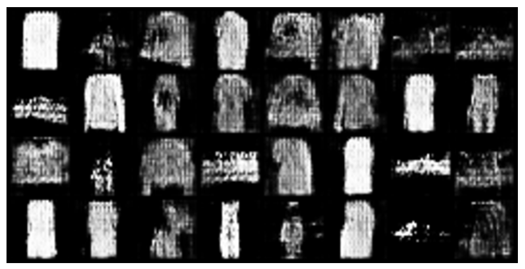
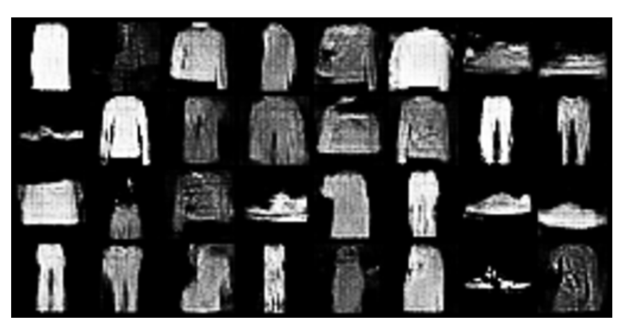
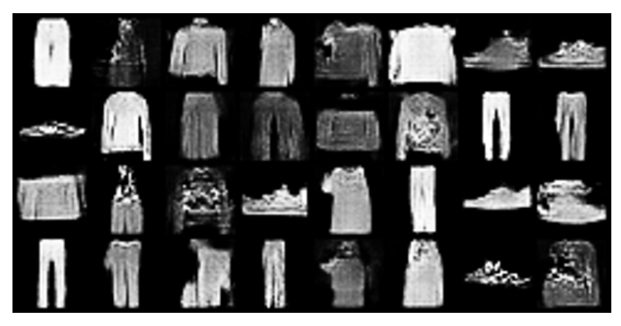

# DCGAN for Image Generation

This project focuses on training a Deep Convolutional Generative Adversarial Network (DCGAN) and visualizing its progression in generating realistic clothing images from the FashionMNIST dataset. 

The Generator and Discriminator have the following architecture:

**Generator Architecture:**

We start with a dense layer that maps a 100-length Gaussian noise vector to a 7 × 7 × 256 vector.
We use transpose 2D convolutions: Transform 256 × 7 × 7 to 128 × 7 × 7 to 64 × 14 × 14 to 1 × 28 × 28, and apply Batch Normalization and Leaky ReLU (except in the last layer, which uses tanh).

**Discriminator Architecture:**

We use 2D convolutions: Transform 1 × 28 × 28 to 64 × 14 × 14 to 128 × 7 × 7. Each convolution is followed by Leaky ReLU (slope 0.3) and Dropout (0.3). Finally we use a dense layer flattens the output and maps it to a scalar.

For training, we use binary cross-entropy loss for both the generator and discriminator. We train using the Adam optimizer with a learning rate of 10^-4 for 50 epochs with batchsize = 32.

We display generated images after 10, 30, and 50 epochs. The results are as below:

**After 10 epochs:**

**After 30 epochs:**

**After 50 epochs:**

As it can be seen from the above examples, the generated results have improved during training.

